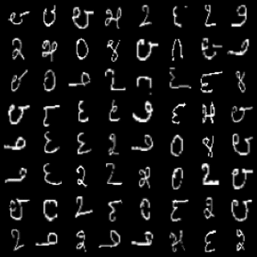

# GT CS7641 SP2020 Project - Team 3 Learning Machines Domain Adaptation via Semi-supervised Image-to-image Translation

## Project GitHub Pages
https://ast0414.github.io/semit/

## Presentation Video

## Abstract (of abstract)
In this project, we propose a (semi-)supervised image-to-image translation framework as a domain adaptation method based on a combination of variational autoencoders and generative adversarial networks upon a shared latent space assumption.

## Codes
- [environment.yml](environment.yml): the conda environment file used in this project. 
- [0_data_exploration.ipynb](0_data_exploration.ipynb): Data exploration and preprocessing.
- [1_mnist_baseline.ipynb](1_mnist_baseline.ipynb): Train and test a MNIST baseline classification model.
- [2_kannada_baseline.ipynb](2_kannada_baseline.ipynb): Train and test a Kannada-MNIST baseline classification model.
- [3_VAE_examples.ipynb](3_VAE_examples.ipynb): An example of VAE (from PyTorch Official Example) using our preprocessed MNIST data file.
- [4_train_VAE.py](4_train_VAE.py): Practice training of our VAE module separately.
- [5_train_GAN.py](5_train_GAN.py): Practice training of our GAN module separately.
- [6_train_UNIT.py](6_train_UNIT.py): Train an unsupervised translator.
- [7_train_SUIT.py](7_train_SUIT.py): Train a fully supervised translator.
- [8_train_SEMIT.py](8_train_SEMIT.py): Train a semi-supervised translator.
- [9_test_translator.py](9_test_translator.py): Evaluate the classification accuracy for a trained translator.
- [10_generate_umap.py](10_generate_umap.py): Generate visualization of the latent space using UMAP or t-SNE.
- [11_visualize_embedding.ipynb](11_visualize_embedding.ipynb): Plot the visualization from 10.

## Results Preview
### Reconstruction and Translation
| Dataset | Input | Reconstruction | Translation |
|:-:|:-:|:-:|:-:|
| MNIST   |  |  |  |
| K-MNIST |  |  |  |

### t-SNE Visualization of the Shared Latent Space

