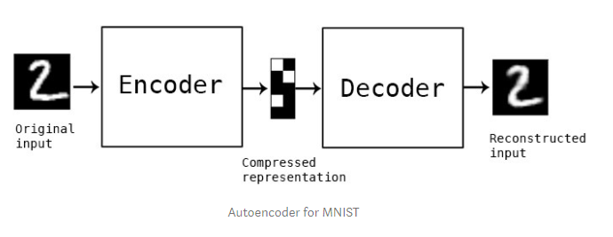
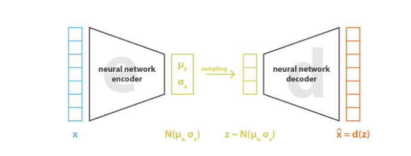
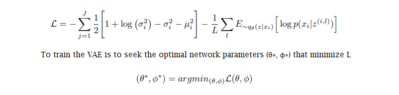

# StackEdit Working?
- Sungtae - working

# Intro
Brief introduction about our motivation

## MNIST and Kannada-MNIST
Brief description of MNIST and Kannada-MNIST

# Methods

## What is VAE?
In general, autoencoder is a form of unsupervised learning algorithm that implements the use of neural networks with the typical goal of data compression and dimensionality reduction.

Overall, the structure of an autoencoder can be outlined as followed (1):

<p align="center">
    
    <br>
    <em>img source: "https://towardsdatascience.com/auto-encoder-what-is-it-and-what-is-it-used-for-part-1-3e5c6f017726"</em>
</p>

* Encoder: the neural network responsible that is responsible for learning how to perform dimensionality reduction and produce a representation  of the reduced data
* Bottleneck (latent space): the representation, in the form of a vector, of the input after compression is performed
* Decoder: the neural network responsible for reproducing the original input from the bottleneck
  
Essentially, dimensionality reduction is performed through the training of the encoder and decoder in order to tune the neural networks' parameters and minimize reconstruction loss (which is typically represented as the mean squared error) between input and output. While autoencoders have been used and proven to be effective models for data compression, they cannot be used to generate new content just by having the decoder taking a sample vector within the latent space. This stems from the lack of regularization of the latent space by the autoencoder, whose learning and training processes direct towards the single goal of encoding and decoding the input. With the latent space constructed as distinct clusters by the encoder, thus exhibiting discontinuities, random sampling from such latent space and feeding it back into the decoder will result in non-meaningful output.

Variational Autoencoder (VAE) is a specific framework within "generative modeling", which in itself, is an area of machine learning that deals with distribution models of data points within a high dimensional space. While structurally similar to an autoencoder, by which it also contains an encoder, decoder and latent space, to accomplish the generative process, VAE's encoder produces a distribution (enforced to approximate a standard normal distribution) within the latent space rather than encoding a vector representation (2).

<p align="center">
    
    <br>
    <em>img source: "https://towardsdatascience.com/understanding-variational-autoencoders-vaes-f70510919f73"</em>
</p>

Under this model, the generation of new information is performed through the sampling within the distribution and processing of the decoder. To analyze the competency of VAE model, rather than implementing the use mean squared error between input and output, analysis is typically performed using a combination of reconstruction loss (the expected log-likelihood of specific data points) and latent loss (the Kullback-Leibler divergence, a quantification of the difference between two probability distributions, between the latent distribution and unit Gaussian).

<p align="center">
    
    <br>
    <em>img source: "https://arxiv.org/abs/1907.08956"</em>
</p>

In regards to the loss function, the left term represent to the latent loss (KL divergence) while the right term is the reconstruction loss, with J and L referring to the dimension of the latent vector z and sample size, respecitively. The goal of the VAE is to train the encoder and decoder so that their parameters θ* and φ*, respectively, result in the minimum loss function calculation (3).

Variational autoencoders have been incorporated in literatures and practical scenarios for many different purposes, including the interpolation of facial images with respect to different attributes (age, hair color, expression, etc.). For this particular project, Variational Autoencoders is combined with Generative Adversarial Networks as part of a UNIT framework that is implemented for image-to-image translation, specifically, the translation from Kannada MNIST to MNIST digits.

reference:
(1) https://towardsdatascience.com/auto-encoder-what-is-it-and-what-is-it-used-for-part-1-3e5c6f017726
(2) https://towardsdatascience.com/understanding-variational-autoencoders-vaes-f70510919f73
(3) https://arxiv.org/abs/1907.08956

## What is GAN?
about generative adversarial network

# Experiments

For our experiment, we utilized our convolutional VAE that we created. We also used a baseline models for Kannada-MNIST datasets as well as a classification model of MNIST data. First, we ran our convolutional VAE model on the Kannada MNIST dataset that we retrieved from Kaggle. From the convolutional VAE, we obtained accuracy values that were then compared with the accuracy values of our baseline models for Kannada-MNIST data and MNIST data. This allowed us to ultimately determine whether our model that we created could translate Kannada numerical values effectively.

## Baselines

We compared the results of our classification model to a baseline Kannada-MNIST model. The baseline model was a convulutional neural network with the following layers:
* convolutional layers that had increasing output filter sizes (from 32 to 256)
* a dropout layers with a rate of 0.5 for each convolutional layer 
* flatten layer
* a dense layer of 512x10 units 

The classification model for MNIST data takes in the MNIST data obtained from the VAE model and creates a convolutional neural network with the following layers:
* convolutional layers that had increasing output filter sizes (from 32 to 256)
* leaky relu layer
* dropout layer
* flatten layer
* dense layer with dimensions 512x10

The baseline models showed us at what accuracy image to image translation should perform in order to be effective for both MNIST and Kannada-MNIST data. We used the baseline model of Kannada-MNIST data as the baseline model for Dig-MNIST data as well. The accuracy of this baseline data can be used to compare with the accuracy we get from our CVAE implementation.

## Results
Our results are depicted visually below. We have shown the loss curve of the CVAE implementation to show that our model is of good fit. We also visually show the translation between KMNIST and MNIST data from MNIST to KMNIST. Our classification performance, which compares the accuracy of each of our models, is also shown below. Finally, we depicted the shared latent space of each of the numerical digits in Kannada and the regular English digits.

The CVAE obtained a loss function that is displayed below. This graph shows both the training and validation loss that was obtained. The first graph shows the loss for the Kannada MNIST dataset and the second graph shows the loss for the MNIST dataset:


For both of these loss functions, we see that our model isn't overfitting nor underfitting. This means that our model can learn from a variety of datasets and can use what it has learned to evaluate generalized data.

### Translation
Below is a visual representation of our translation that is occurring. As you can see, with our MNIST data as input, we translate the data through reconstruction and obtain an output of Kannada-MNIST data. With Kannada-MNIST data as an input, we can translate to obtain MNIST data.

| Dataset | Input $$X_i$$ | Reconstruction $$X_i \rightarrow \widetilde{X}_i$$ | Translation $$X_i \rightarrow \widetilde{X}_j$$|
|:-:|:-:|:-:|:-:|
| MNIST   |  |  |  |
| Kannada |  |  |  |

### Classification Performance

We obtained 5 different accuracy values for each of our datasets. For unsupervised, 1% semi-supervised, 5% semi-supervised, 10% semi-supervised, and fully supervised learning, our translation of MNIST data has a high accuracy of about 98%. 

The Fowlkes-Mallows score is another evaluation metric that we used to show how well our model performed. It shows the similarity among the clusters that are obtained after multiple clustering algorithms have been run on them.

|        |           |
|:-:|:-:|:-:|
|            |  |

### Visualization of the Shared Latent Space

|       |
|:-:|
|  |

# Conclusion
concluding remarks


# Cheat Sheet

Text can be **bold**, _italic_, ~~strikethrough~~ or `keyword`.

[Link to another page](./another-page.html).

There should be whitespace between paragraphs.

There should be whitespace between paragraphs. We recommend including a README, or a file with information about your project.

# Header 1

This is a normal paragraph following a header. GitHub is a code hosting platform for version control and collaboration. It lets you and others work together on projects from anywhere.

## Header 2

> This is a blockquote following a header.
>
> When something is important enough, you do it even if the odds are not in your favor.

### Header 3

```js
// Javascript code with syntax highlighting.
var fun = function lang(l) {
  dateformat.i18n = require('./lang/' + l)
  return true;
}
```

```ruby
# Ruby code with syntax highlighting
GitHubPages::Dependencies.gems.each do |gem, version|
  s.add_dependency(gem, "= #{version}")
end
```

#### Header 4

*   This is an unordered list following a header.
*   This is an unordered list following a header.
*   This is an unordered list following a header.

##### Header 5

1.  This is an ordered list following a header.
2.  This is an ordered list following a header.
3.  This is an ordered list following a header.

###### Header 6

| head1        | head two          | three |
|:-------------|:------------------|:------|
| ok           | good swedish fish | nice  |
| out of stock | good and plenty   | nice  |
| ok           | good `oreos`      | hmm   |
| ok           | good `zoute` drop | yumm  |

### There's a horizontal rule below this.

* * *

### Here is an unordered list:

*   Item foo
*   Item bar
*   Item baz
*   Item zip

### And an ordered list:

1.  Item one
1.  Item two
1.  Item three
1.  Item four

### And a nested list:

- level 1 item
  - level 2 item
  - level 2 item
    - level 3 item
    - level 3 item
- level 1 item
  - level 2 item
  - level 2 item
  - level 2 item
- level 1 item
  - level 2 item
  - level 2 item
- level 1 item

### My image


### Small image


### Large image


### Definition lists can be used with HTML syntax.

<dl>
<dt>Name</dt>
<dd>Godzilla</dd>
<dt>Born</dt>
<dd>1952</dd>
<dt>Birthplace</dt>
<dd>Japan</dd>
<dt>Color</dt>
<dd>Green</dd>
</dl>

```
Long, single-line code blocks should not wrap. They should horizontally scroll if they are too long. This line should be long enough to demonstrate this.
```

```
The final element.
```
<!--stackedit_data:
eyJoaXN0b3J5IjpbMTE4ODA2NzMzXX0=
-->
