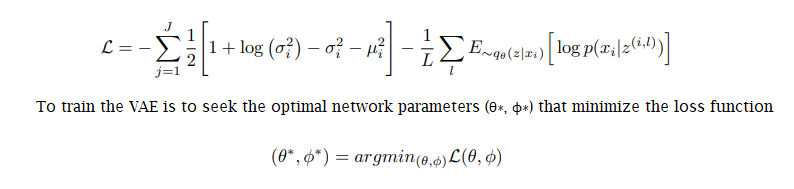
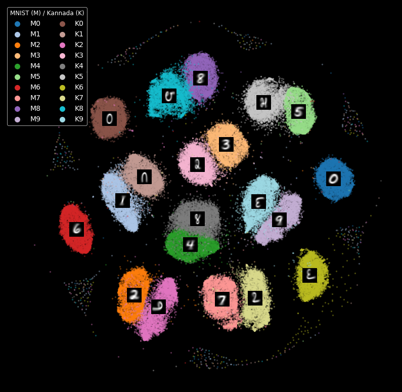

# Introduction

It is often hard to train a model on predicting labels for a given set of data that will perform well on new sets of data as well. In machine laerning community, thus, **_Generalization_** is an important aspect of algorithms to handle unseen data and to make correct decision/prediction on them on running time. There are several ways to improve the generalization of a machine learning algorithm such as L1/L2 regularization [(Ng, 2004)](#ng2004), Dropout [(Srivastava et al., 2014)](#srivastava2014) for neural networks, etc.

On the other hand, training a new model on new datasets may also be infeasible due to challenges. Especially, it is difficult or even impossible to train a supervised model when there is a lack of labels for the new data. Acquiring a set of accurate labels for a new dataset is often challenging due to its nature of time and labor-intensive process.

One of possible approches in such circumstance is **_domain adaptation_**, adapting a classifier trained using labeled samples in one domain (**_source domain_**) to classify samples in a new domain (**_target domain_**) while only a few of labeled samples in the new domain or none of them are available during training time. There have been early works in domain adaptation using subspace learning [(Fernando et al., 2013)](#fernando2013), deep feature learning [(Taigman et al., 2017)](#taigman2017), etc.

[Liu et al. (2017)](#liu2017) proposed the UNsupervised Image-to-image Translation (UNIT) framework that combines Variational Autoencoders (VAEs) [(Kingma and Welling, 2014)](#kingma2014) and Genarative Adversarial Networks (GANs) [(Goodfellow et al, 2014)](#goodfellow2014) with a shared-latent space assumption and they showed the UNIT framework can be utilized in domain adaptation problems. As an unsupervised method, however, the UNIT framework is expected to work only when the two domains have similar feature representations, e.g., visual look for images, for the same semantic classes. For example, the datasets used in their domain adaptation experiments, MNIST, USPS, and SVHN, are different datasets having different colors or lighting environment, but they are all Arabic numeral images which is the most critical visual characteristic in the class decision.

**_What if we need/want to apply domain adaption for datasets having totally different visual appearance for the same semantic classes?_** For example, MNIST and Kannda-MNIST, the datasets we will introduce shortly, both are handwritten digits datasets, but the former one contains Arabic numerals and the later one contains Kannada numerals.

In this project, we extend the UNIT framework to cope with the situations that the target domain classes have different visual representations and few/none of labeled samples. By introducing auxiliary classifiers into the framework, our proposed method is able to produce accurate image-to-image translation between the domains despite of their different visual appreance. Furthermore, our experimental results show that the proposed translator model gives higher classification accuracy than the baseline models trained on fully-labeled dataset for both domains.

## MNIST and Kannada-MNIST

The MNIST dataset is a commonly used dataset in machine learning. This dataset consists of images of size 28 pixels by 28 pixels. Each image contains a hand-drawn arabic numeral between 0 to 9 inclusive. Typically, this dataset is used to train a supervised machine learning model to predict an arabic numeral label for a given 28 by 28 pixel image.

The Kannada-MNIST, or K-MNIST, dataset is similar to the MNIST dataset except the images are of hand-drawn Kannada numerals instead of arabic numerals. For reference, Kannada is a language predominantly spoken in Karnataka (a state in the southwest of India). This dataset is fairly new, and some are still researching on how to train the most accurate model to predict the labels for this dataset.

The followings are example images of MNIST and K-MNIST data for each numeric class:

| MNIST | Kannada |
|:-|:-|
|  |  |
| Source: https://www.researchgate.net/figure/Example-images-from-the-MNIST-dataset_fig1_306056875 | Source: https://towardsdatascience.com/a-new-handwritten-digits-dataset-in-ml-town-kannada-mnist-69df0f2d1456 |

# Background

## Variational Autoencoders
In general, autoencoder is a form of unsupervised learning algorithm that implements the use of neural networks with the typical goal of data compression and dimensionality reduction.

Overall, the structure of an autoencoder can be outlined as followed (1):

<p align="center">
    
    <br>
    <em>Autoencoder</em>
    <br>
    Source: https://towardsdatascience.com/auto-encoder-what-is-it-and-what-is-it-used-for-part-1-3e5c6f017726
</p>

* Encoder: the neural network responsible that is responsible for learning how to perform dimensionality reduction and produce a representation  of the reduced data
* Bottleneck (latent space): the representation, in the form of a vector, of the input after compression is performed
* Decoder: the neural network responsible for reproducing the original input from the bottleneck

Essentially, dimensionality reduction is performed through the training of the encoder and decoder in order to tune the neural networks' parameters and minimize reconstruction loss (which is typically represented as the mean squared error) between input and output. While autoencoders have been used and proven to be effective models for data compression, they cannot be used to generate new content just by having the decoder taking a sample vector within the latent space. This stems from the lack of regularization of the latent space by the autoencoder, whose learning and training processes direct towards the single goal of encoding and decoding the input. With the latent space constructed as distinct clusters by the encoder, thus exhibiting discontinuities, random sampling from such latent space and feeding it back into the decoder will result in non-meaningful output.

Variational Autoencoder (VAE) is a specific framework within "generative modeling", which in itself, is an area of machine learning that deals with distribution models of data points within a high dimensional space. While structurally similar to an autoencoder, by which it also contains an encoder, decoder and latent space, to accomplish the generative process, VAE's encoder produces a distribution (enforced to approximate a standard normal distribution) within the latent space rather than encoding a vector representation (2).

<p align="center">
    
    <br>
    <em>Variational Autoencoder</em>
    <br>
    Source: https://towardsdatascience.com/understanding-variational-autoencoders-vaes-f70510919f73
</p>

Under this model, the generation of new information is performed through the sampling within the distribution and processing of the decoder. To analyze the competency of VAE model, rather than implementing the use mean squared error between input and output, analysis is typically performed using a combination of reconstruction loss (the expected log-likelihood of specific data points) and latent loss (the Kullback-Leibler divergence, a quantification of the difference between two probability distributions, between the latent distribution and unit Gaussian).

<p align="center">
    
    <br>
    <em>img source: "https://arxiv.org/abs/1907.08956"</em>
</p>

In regards to the loss function, the left term represent to the latent loss (KL divergence) while the right term is the reconstruction loss, with J and L referring to the dimension of the latent vector z and sample size, respecitively. The goal of the VAE is to train the encoder and decoder so that their parameters θ* and φ*, respectively, result in the minimum loss function calculation (3).

Variational autoencoders have been incorporated in literatures and practical scenarios for many different purposes, including the interpolation of facial images with respect to different attributes (age, hair color, expression, etc.). For this particular project, Variational Autoencoders is combined with Generative Adversarial Networks as part of a UNIT framework that is implemented for image-to-image translation, specifically, the translation from Kannada MNIST to MNIST digits.

reference:

(1- for img) https://towardsdatascience.com/auto-encoder-what-is-it-and-what-is-it-used-for-part-1-3e5c6f017726

(2- for img) https://towardsdatascience.com/understanding-variational-autoencoders-vaes-f70510919f73

(3- for img and explanation on VAE loss function) https://arxiv.org/abs/1907.08956


## Generative Adversarial Networks
GAN stands for Generative Adversarial Network, which are deep-learning based generative models. GANs are a model architecture for training generative models which are widely used to translate inputs from one domain to another. GANs were first introduced in 2014 by Ian Goodfellow et al in a paper titled "[Generative Adversarial Networks]([https://arxiv.org/abs/1406.2661](https://arxiv.org/abs/1406.2661))" . While initially proposed as a model for unsupervised learning, GANs have also proved to be useful for semi-supervised learning, fully supervised learning and reinforcement learning.

The GAN model involves two sub-models:

1. **Generator Model** - This is a model that is used to generate new examples from the problem domain.

	The input to the model is a vector from a multidimensional space. After training with the dataset, this multidimensional space is mapped to corresponding points in the problem domain. This forms a compressed representation of the multidimensional data space.

	After training, the generator model is used to generate new samples.

2. **Discriminator Model** - This model is used to classify example inputs based on whether they come from the problem domain or from the generated examples.

	The model inputs an example from the domain (real or generated) and classifies it with a binary label *real* or *fake*. The *real* examples come from the training dataset, while the *fake* examples come from the generator model.

<p align="center">
    
    <br>
    <em>Generative Adversarial Network</em>
</p>

#### Objective Function
 
 In utilizing a GAN, we aim to optimize the objective function as described below. First, let us define some variables:
<p align="center">
    
    <br>
</p>

Now, we want to build a discriminator model that maximizes the real data D(x) while minimizing the fake data D(G(x)). We also want to build a Generator model that maximizes the fake, noisy data D(G(x)).
The following is a quick look at the cost functions for the Discriminator and Generator models:

<p align="center">
    
    <br>
</p>

Once these losses are calculated, the value of their gradient is calculated w.r.t their parameters and back propagated through the individual models.

In essence, D and G play a two-player, minimax game to optimize the value of the expectation objective function:

<p align="center">
    
    <br>
</p>

<p align="center">
    
    <br>
</p>

A key use of generative adversarial networks comes in image-to-image translation, to map images from the input domain to a different output domain.

Images and equations source: [https://medium.com/deep-math-machine-learning-ai/ch-14-general-adversarial-networks-gans-with-math-1318faf46b43](https://medium.com/deep-math-machine-learning-ai/ch-14-general-adversarial-networks-gans-with-math-1318faf46b43)
# Image-to-Image Translation Networks
In this project, we use a framework that combines VAE and GAN to perform image-to-image translation tasks.
Specifically, we adopt the UNIT framework proposed by [Liu et al. (2017)](#liu2017), which was used in unsupervised image-to-image translation tasks, while we further extend it to semi-supervised and fully-supervised image translation tasks.

## Framework
The overall framework of our proposed model is depicted in the following figure.

<p align="center">
    
    <br>
    <em>Image-to-image translation networks. </em>
</p>

It is a combination of VAE and GAN architecture that consists of the following modules:

* **Encoders**: each encoder $$E_i$$ encodes samples from a source domain data $$X_1$$ or a target domain data $$X_2$$ into a shared latent space<sup>[*](#shared)</sup> $$Z$$.

* **Decoders/Generators**: each decoder (in terms of VAE) or generator (in terms of GAN) $$G_i$$ reconstructs samples $$\widetilde{X}_{i}^{j}$$ using latent vectors $$z$$ where the subscript $$i$$ means the decoder's own domain and the superscript $$j$$ means the sample's origin domain. For example, $$\widetilde{X}_1^2$$ represents the samples reconstructed in $$X_1$$ domain using the latent vectors encoded using the input data from $$X_2$$ domain.

* **Discriminators**: each discriminator $$D_i$$ judges whether inputs are the **_real_** samples from the domain $$X_i$$ or **_fake (translated)_** samples, i.e., $$\widetilde{X}_1^2$$ or $$\widetilde{X}_2^1$$. At the same time, each discriminator $$D_i$$ also gives class predictions for input samples, regardless of whether they are real or fake, similar to the one used in AC-GAN [(Odena et al., 2017)](#odena2017).

#### <a name="shared"></a> *Shared Latent Space

| <br><em>Source: Liu et al. (2017)</em> | Since the latent space $$Z$$ is shared by both domains, it is possible to generate a target domain sample $$\widetilde{x}_2$$ from a latent vector $$z$$ that was encoded from a source domain sample $$x_1$$, e.g., $$\widetilde{x}_2=G_2(E_1(x_1))$$, or in the opposite direction. |

All these modules are implemented as neural networks.

## Training
In this section, we describe how the image-to-image translation model is trained.

### Preliminaries
Assuming that we have two image data domain $$X_1$$ and $$X_2$$, e.g., MNIST and K-MNIST, samples from each domain are drawn from each marginal distribution $$P_{X_1}$$ and $$P_{X_2}$$.

In our translator model, the (variational) encoder outputs a mean vector $$E_{\mu}(x)$$ and a standard deviation vector $$E_{\sigma}(x)$$. Thus, we represent the latent distribution $$q$$ and the latent codes $$z$$ drawn from this distribtuion as

$$
\begin{align}
z_1 \sim q_1(z_1|x_1) &\equiv \mathcal{N}(z_1 | E_{1,\mu}(x_1), E_{1,\sigma}(x_1))\\
z_2 \sim q_2(z_2|x_2) &\equiv \mathcal{N}(z_2 | E_{2,\mu}(x_2), E_{2,\sigma}(x_2))
\end{align}
$$

according to the encoder input $$x_1 \in X_1$$ or $$x_2 \in X_2$$. Also, we assume the standard normal distribution for the prior distribution of $$z$$.

### Loss and Objective Functions
There are three different types of loss functions used in training of our image-to-image translation models. Each loss function has its own objective according to the role of the corresponding modules in the entire model.

#### VAE Loss
First of all, the VAE losses are deployed to train the encoders $$E_i$$ and the decoders/generators $$G_i$$ to be able to reconstruct the samples from its own domain dataset $$X_i$$ using the stochastic samples $$z$$ from the shared latent space $$Z$$.
The VAE loss function for each domain can be written as follows: 

$$\mathcal{L}_{\text{VAE}_1}(E_1, G_1) = \lambda_1 \text{KL}(q_1(z_1|x_1) \Vert p_\eta (z)) - \lambda_2 \mathbb{E}_{z_1 \sim q_1(z_1|x_1)}[\log p_{G_1} (x_1 | z_1)]$$

$$\mathcal{L}_{\text{VAE}_2}(E_2, G_2) = \lambda_1 \text{KL}(q_2(z_2|x_2) \Vert p_\eta (z)) - \lambda_2 \mathbb{E}_{z_2 \sim q_2(z_2|x_2)}[\log p_{G_2} (x_2 | z_2)]$$

where the hyper-parameters $$\lambda_1$$ and $$\lambda_2$$ control the balance between the reconstruction error and the KL divergence of the latent distribution from its prior. We used fixed values of $$\lambda_1 = 0.001$$ and $$\lambda_2 = 0.01$$ in this project following the configuration used by [(Liu et al., 2017)](#liu2017).

#### GAN Objective
Next, GAN objectives are used to enforce the translated images look like images from the target domain through the adversarial training of generators and discriminators. For example, $$D_1$$ tries to discriminates the real samples $$x_1 \sim X_1 $$ and the translated fake samples $$\widetilde{x}_1^2 = G_1(z_2)$$. On the other hand, $$G_1$$ tries to make $$D_1$$ classify $$\widetilde{x}_1^2$$ as real samples. It can be formulated by following equations:

$$
\mathcal{L}_{\text{GAN}_1}(E_2, G_1, D_1) = \mathbb{E}_{x_1 \sim P_{X_1}}[\log D_{1s}(x_1)] + \mathbb{E}_{z_2 \sim q_2(z_2|x_2)}[\log (1 - D_{1s}(G_1(z_2)))]
$$

$$
\mathcal{L}_{\text{GAN}_2}(E_1, G_2, D_2) = \mathbb{E}_{x_2 \sim P_{X_2}}[\log D_{2s}(x_2)] + \mathbb{E}_{z_1 \sim q_1(z_1|x_1)}[\log (1 - D_{2s}(G_2(z_1)))]
$$

where each $$D_{is}$$ refers to the discrimination output of $$D_i$$.

#### Classification Loss
Finally, we also introduce the classification losses for the labeled samples, if any, to encourage matching the classes of the samples between two domains. For example, a translated sample $$\widetilde{x}_1^2 = G_1(E_2(x_2))$$ where $$x_2$$ has its label $$y_2$$ in the domain $$X_2$$ should be classified by $$D_1$$ as the same class in the domain $$X_1$$. It can be formulated by cross-entropy loss or negative log-likelihood: 

$$
\begin{align}
\mathcal{L}_{\text{CLASS}_1}(E_2, G_1, D_1) &= \alpha_1 \cdot {\underset { (x_1, y_1) \sim P_{X_{1}^{\text{labeled}}} }{\operatorname {\mathbb{E}} }}[−\log D_{1c}(y_1|x_1)] + \alpha_2 \cdot {\underset { z_2 \sim q_2(z_2|x_2), (x_2, y_2) \sim P_{X_{2}^{\text{labeled}}} }{\operatorname {\mathbb{E}} }}[−\log D_{1c}(y_2|G_1(x_2))]\\
\mathcal{L}_{\text{CLASS}_2}(E_1, G_2, D_2) &= \alpha_2 \cdot {\underset { (x_2, y_2) \sim P_{X_{2}^{\text{labeled}}} }{\operatorname {\mathbb{E}} }}[−\log D_{2c}(y_2|x_2)] + \alpha_1 \cdot {\underset { z_1 \sim q_1(z_1|x_1), (x_1, y_1) \sim P_{X_{1}^{\text{labeled}}} }{\operatorname {\mathbb{E}} }}[−\log D_{2c}(y_1|G_2(x_1))]
\end{align}
$$

where $$\alpha_i$$

$$
\alpha_i = \eta \cdot \frac{\text{the number of all samples in } X_i}{\text{the number of labeled samples in } X_i}
$$

and $$\eta$$ is a hyper-parameters that controls the weight of classification loss. We use $$\eta=1$$ as a default value in this project.

### Joint Optimization
Combining the losses and objective functions above together, we jointly optimize the following minimax problem:

$$
\begin{align}
{\underset { E_1, E_2, G_1, G_2 }{\operatorname { min } }} \;\; {\underset { D_1, D_2 }{\operatorname { max } }} \quad & \mathcal{L}_{\text{VAE}_1}(E_1, G_1) + \mathcal{L}_{\text{GAN}_1}(E_2, G_1, D_1) + \mathcal{L}_{\text{CLASS}_1}(E_2, G_1, D_1)\\ + &\mathcal{L}_{\text{VAE}_2}(E_2, G_2) + \mathcal{L}_{\text{GAN}_2}(E_1, G_2, D_2) + \mathcal{L}_{\text{CLASS}_2}(E_1, G_2, D_2)
\end{align}
$$

We use an alternating training procedure to solve this. Specifically, we first update $$D_1$$ and $$D_2$$ by applying a (stochastic) gradient **_ascent_** step while the parameters of the other modules are fixed. Then, $$E_1, E_2, G_1,$$ and $$G_2$$ are updated with a gradient **_descent_** step while $$D_1$$ and $$D_2$$ are fixed.

# Experiments
We conducted various experiments to answer the following questions:
* Is our translator model able to translate images to the target domain?
* Are the translated images can be classified correctly by the target domain classifier model?
* Is the shared latent space actually meaningful?

All experiments are done with Python 3.7 with several packages including PyTorch and TensorFlow. All source codes are available at [our project GitHub repository](https://github.com/ast0414/semit).

## Setup
### Dataset Preparation
#### Source and Target Domain
We use K-MNIST as our source domain and MNIST as our target domain. In other words, our model aims to translate images of the Kannada numeral to ones look like typical arabic numerals. 

#### Amount of Supervision
Assuming that a well-studied target domain dataset is available, we use the complete MNIST dataset with all labels. On the other hand, we do experiments with several possible scenarios regarding the source domain dataset. Specifically, we compare the classification accuracy of the translated images when we use the K-MNIST training set with no labels, partial labels, and all labels.

#### Preprocessing
We use resized 32x32 images for the development convenience which are then normalized to the range of [0, 1] by default. Our translator models use shifted and re-scaled data whose range is [-1, 1].

#### Train / Validation / Test Splits
While we use the original splits of 60K training set and 10K test set for both dataset, we extract 5K samples as a validation set from each training set by using stratified random sampling.

| Dataset | Train | Validation | Test |
|:-:|:-:|:-:|:-:|
| MNIST |  |  |  |
| Kannada |  |  |  |

## Model Architecture
All modules in our image-to-image translator are based on convolutional neural networks. The architecture of each module is summarized in the table below, where Nx is the number of filters in a convolutional (Conv2D) or transposed convolutional (TransConv2D) layer or the number of hidden units in a fully-connected (FC) layer, Kx is the kernel size, Sx is the stride size, and Px is the padding size. We use Batch Normalization [(Ioffe et al., 2015)](#ioffe2015) after each layer in the encoder and generator, and Dropout [(Srivastava et al., 2014)](#srivastava2014) of 0.5 drop rate after each layer in the discriminator. Leaky ReLU [(Maas et al., 2013)](#maas2013) activation function is mainly used except the last layers of the modules.

| Layer | Encoder | Decoder/Generator | Discriminator |
|---|---|---|---|
| 1 | Conv2D(N32, K4, S2, P1) - BatchNorm - LeakyReLU | TransConv2D(N512, K4, S2, P1) - BatchNorm - LeakyReLU | Conv2D(N32, K4, S2, P1) - LeakyReLU - Dropout |
| 2 | Conv2D(N64, K4, S2, P1) - BatchNorm - LeakyReLU | TransConv2D(N256, K4, S2, P1) - BatchNorm - LeakyReLU | Conv2D(N64, K4, S2, P1) - LeakyReLU - Dropout|
| 3 | Conv2D(N128, K4, S2, P1) - BatchNorm - LeakyReLU | TransConv2D(N128, K4, S2, P1) - BatchNorm - LeakyReLU | Conv2D(N128, K4, S2, P1) - LeakyReLU - Dropout|
| 4 | Conv2D(N256, K4, S2, P1) - BatchNorm - LeakyReLU | TransConv2D(N64, K4, S2, P1) - BatchNorm - LeakyReLU | Conv2D(N256, K4, S2, P1) - LeakyReLU - Dropout|
| 5 | Conv2D(N512, K4, S2, P1) - BatchNorm - LeakyReLU | TransConv2D(N32, K4, S2, P1) - BatchNorm - Tanh | Conv2D(N512, K4, S2, P1) - LeakyReLU - Dropout|
| 6a | $$\mu$$: Conv2D(N512, K1, S1, P0)  |   | Real/Fake: FC(N1) - Sigmoid|
| 6b | $$\sigma$$: Conv2D(N512, K1, S1, P0) - Softplus |   | Class: FC(N10) - Softmax|

The model parameters were optimized with Adam [(Kingma and Ba, 2015)](#kingma2015) optimizer with the learning late of 0.0002 and the momentum of $$\beta_1 = 0.5$$ and $$\beta_2=0.999$$. Our translator models were trained over 100 epochs with mini-batchs of 64 samples.

## Baseline Classifiers

We compare the classification accuracy of our translator model to a baseline classification model for each dataset. Each baseline classifier resembles the discriminator module in our translator model except there is no source discrimination (real/fake) head in the last layer. Each baseline classifier is trained using either dataset only and thus it is expected to perform well only for the domain where it was trained. On the other hand, our translator model is trained using both dataset regardless of the number of labeled training samples from the source domain; therefore, we expect that our translator well classifies samples from both domains using the discriminators $$D_1$$ or $$D_2$$.

These comparisons allow us to ultimately determine whether our translator model could translate Kannada numeral images to arabic ones (and vice versa) effectively.


## Results
<!-- Our results are depicted visually below. We have shown the loss curve of the CVAE implementation to show that our model is of good fit. We also visually show the translation between K-MNIST and MNIST data from MNIST to K-MNIST. Our classification performance, which compares the accuracy of each of our models, is also shown below. Finally, we depicted the shared latent space of each of the numerical digits in Kannada and the regular English digits. -->

### Validation of VAE Module
As the foremost step of the entire project, we trained and evaluated the VAE module, a set of the encoder and the generator, for each dataset independently first since it is a core of our translator model. The VAE loss values over about 200 epochs of training for each dataset are shown below.

| MNIST | K-MNIST |
|:-:|:-:|
|  |  |

We confirmed that the VAE module is trained and perform well on both datasets with neither overfitting nor underfitting.

### Translation
To answer the first main question at the beginning of this section, we show how our model successfully translate the images. Visual representations of our translation between Kannada numerals (K-MNIST) and Arabic numerals (MNIST) are shown in the table below. For each dataset (row), each column contains a GIF image as a progress recording over the training epochs for the followings:

1. The first column shows the input images to our model:<br>
$$x_1 \sim X_1$$ (MNIST) or $$x_2 \sim X_2$$ (K-MNIST)
2. The second column shows the reconstructed images by the VAE modules for each domain itself:<br>
$$\widetilde{x}_1^1 = G_1(E_1(x_1))$$ or $$\widetilde{x}_2^2 = G_2(E_2(x_2))$$
3. The last column contains the translated images between the domains:<br>
$$\widetilde{x}_1^2 = G_2(E_1(x_1))$$ or $$\widetilde{x}_2^1 = G_1(E_2(x_2))$$ 

| Dataset | Input $$X_i$$ | Reconstruction $$X_i \rightarrow \widetilde{X}_i^i$$ | Translation $$X_i \rightarrow \widetilde{X}_j^i$$|
|:-:|:-:|:-:|:-:|
| MNIST   |  |  |  |
| K-MNIST |  |  |  |

It is shown that our model gives poor outputs that look like noise for both reconstruction and translation in the early stage of the training. However, they become very clear and realistic as the training progress. We can see that our translator model performs well on both direction of translation, MNIST $$\rightarrow$$ K-MNIST and K-MNIST $$\rightarrow$$ MNIST.

### Classification Performance
Next, we investigated whether the translated images can be classified correctly by the translator itself. Please note that our translator model already contains a classifier for each domain as a classification head of the discriminator. Therefore, we do not need to train a classifier for the translated images from scratch.

We used the discriminator of MNIST domain, $$D_1$$, to classify the images in both datasets. While the MNIST images were fed into $$D_1$$ directly, $$\hat{y}_1 = D_1(x_1)$$, for the validation purpose, K-MNIST images were translated to MNIST domain first before classifying them, $$\hat{y}_2 = D_1(G_1(E_2(x_2)))$$. On the other hand, Dig-MNIST test set, which is a difficult version of K-MNIST test set, was also evaluated as an extended comparison.

We compared the classification performance of 5 different translators trained by different amounts of the labels (supervision) for K-MNIST while all labels were used for MNIST. While the accuracy were used as the main metric of comparisons, we also calculated Fowlkes-Mallows Score to see how unsupervised translator performs. The comparison results are summarized in the charts below.


|  |  |

All different translators classify MNIST images well with a high accuracy of about 99%, which was expected because we used all labels for MNIST images. 

On the other hand, the accuracy of our K-MNIST data translation increases from unsupervised learning to fully supervised learning. Using unsupervised learning for K-MNIST translation, our accuracy was about 3%, showing that our model couldn't translate images effectively. However, as Fowlkes-Mallows score shows, there are still some well-formed clusters. We can infer from this that there exists some mapping between K-MNIST class and MNIST class even though their numeric values are not matched due to the lack of supervision by labels. 

With a 1% semi-supervised learning, the accuracy increased tremendously for K-MNIST data translation -- the accuracy was about 88%. This shows that even with a small amount of labeled data, our model can translate at a greater performance. This is further shown with the increase in accuracy for 5% semi-supervised learning (accuracy is about 92%) and for 10% semi-supervised learning (accuracy is about 94%). The highest accuracy achieved with K-MNIST data translation was about 96% accuracy. This was achieved with fully-supervised learning. In sum, with more labeled data, our model can translate Kannada MNIST data better.

It applies same for Dig-MNIST data, where the accuracy also shows an increasing trend as the learning becomes more supervised, from 3% for the unsupervised translation to 76% for the fully-supervised translation.

<!-- For unsupervised learning, the accuracy is about 3%. For 1% semi supervised, the accuracy found was about 59%. For 5% semi supervised, the accuracy is about 67%. For 10% semi supervised, teh accuracy is about 70%. Finally, for fully supervised learning the accuracy is about 75%. Though we have shown that with more labeled data our model can have a higher accuracy with translating Dig MNIST, the highest accuracy obtained was only about 75%, which means that there are still some errors in translation for Dig MNIST. -->

<!-- The Fowlkes-Mallows score is another evaluation metric that we used to show how well our model performed. It shows the similarity among the clusters that are obtained after multiple clustering algorithms have been run. For the MNIST data set, we see that that Fowlkes-Mallows score stays relatively constant at around 0.96, showing that the similarity of clustering is roughly the same for each of the types of learning that we ran our model with. However, for both the K-MNIST and Dig-MNIST data, the Fowlkes-Mallows score increases as the learning changes from unsupervised to fully supervised. This means that the similarity in clusterings increases as there is more labeled data to learn from in the model. With more similar clusterings, it is easier to determine what translates to what. Therefore, it makes sense that as the amount of similarity between clustering increases, so does the trend in accuracy. -->

Meanwhile, we also compared the accuracy of our translator model to the aforementioned baseline classification models as well as some state-of-the-art results, which are summarized in the following table:

| Model | MNIST | K-MNIST | Dig-MNIST |
|---|--:|--:|--:|
| 1% semi-supervised| 98.95 | 88.16 | 59.49 |
| 5% semi-supervised | 99.03 | 91.64 | 67.71 |
| 10% semi-supervised | <span style="color:lime"> 99.19 </span> | 94.37 | 70.49 |
| Fully-supervised | 99.09 | <span style="color:lime"> 96.45 </span> | <span style="color:lime"> 76.12 </span> |
| Our MNIST Baseline | 96.73 | <span style="color:red"> 20.74 </span> | <span style="color:red"> 16.99 </span> |
| Our K-MNIST Baseline | <span style="color:red"> 24.21 </span> | 95.33 | 72.59 |
| MNIST State-of-the-art [(Byerly et al., 2020)](#byerly2020) | <span style="color:cyan"> 99.84 </span> | - | - |
| K-MNIST Kaggle 1st place | - | <span style="color:cyan"> 99.6 </span> | - |

Since the baseline classifiers were trained on each dataset only, they perform very poor on the other domain. On the other hand, our translator model performs well on both domain. Furthermore, our translator performs even better than the baseline classifier for each domain. It can be inferred that the translation task helps on regularization and thus the translator model generalizes well on the classification taks as well.

There is still room for improvements

### Visualization of the Shared Latent Space
Last but not least, we visualize the shared latent space learned by our translator model. We collected all latent vector $$z$$ from both datasets using the encoders $$E_1$$ and $$E_2$$ and construct 2-dimensional visualization embeddings using t-SNE [(Maaten 2014)](#maaten2014).

The visualization below shows that the most corresponding digits of Kannada and Arabic numbers, except 0 and 6, are adjacent to each other in the shared latent space learned, which represents the clustered relationships between two different domains that enable translations between them.

On the other hand, the lack of close connections across the domains for the two numerals, 0 and 6, in the shared latent space might be a possible reason as to why the classification accuracy of K-MNIST after translation is not same as MNIST; the translator might have difficulties on translating them due to the lack of the connections.

<!-- What the visualization below shows is the shared latent space. Latent space helps find a relationship between 2 different domains so that transformations can occur between those 2 domains. When there is a shared latent space, we know that those 2 domains can basically be translated from one to another. What the visualization below shows is that the shared latent space found is between the corresponding digits of Kannada and Arabic numbers. For the most part, each domain in Arabic has a corresponding domain in Kannada that is correct -- the 1s, 2s, 3s, 4s, 5s, 7s, 8s, and 9s match each other. There is no shared latent space between each languages 0s and 6s. The lack of shared latent space between these 2 numerals is a possible reason as to why the accuracy of translation between MNIST and K-MNIST isn't 100%. -->

<!--|       |
|:-:|
|  |
-->
<p align="center">
    
    <br>
    <em>t-SNE visualization of the shared latent space</em>
</p>

# Conclusion
In this project, we designed the (semi-)supervised image-to-image translator using neural networks. It was shown that our translator model is able to translate images between two domains, from K-MNIST to MNIST and vice versa, effectively. Also, our translator model can directly classify the images from both domains. Furthermore, our translator model can be trained with even a small amount of labels for the dataset to be translated. It was enabled by the shared latent space that connects two different data domains together, which was visually confirmed.

# Contributions
- Anh: Led the study and discussion about VAE
- Naman: Led the study and discussion about GAN
- Nitya: Designed and implemented MNIST classification models
- Joshua: Designed and implemented K-MNIST classification models 
- Sungtae: Designed and implemented image-to-image translation models  
- Everyone has equally contributed to web page creation

# References

<a name="ng2004"></a>[(Ng, 2004) Ng, Andrew Y. "Feature selection, L 1 vs. L 2 regularization, and rotational invariance." Proceedings of the twenty-first international conference on Machine learning. 2004.](https://dl.acm.org/doi/10.1145/1015330.1015435)

<a name="fernando2013"></a>[(Fernando et al., 2013) Fernando, Basura, et al. "Unsupervised visual domain adaptation using subspace alignment." Proceedings of the IEEE international conference on computer vision. 2013.](http://openaccess.thecvf.com/content_iccv_2013/html/Fernando_Unsupervised_Visual_Domain_2013_ICCV_paper.html)

<a name="taigman2017"></a>[(Taigman et al., 2017) Taigman, Yaniv, Adam Polyak, and Lior Wolf. "Unsupervised cross-domain image generation." International Conference on Learning Representations (ICLR), 2017.](https://arxiv.org/abs/1611.02200)

<a name="liu2017"></a>[(Liu et al., 2017) Liu, Ming-Yu, Thomas Breuel, and Jan Kautz. "Unsupervised image-to-image translation networks." Advances in neural information processing systems. 2017.](http://papers.nips.cc/paper/6672-unsupervised-image-to-image-translation-network "UNIT")

<a name="kingma2014"></a>[(Kingma and Welling, 2014) Kingma, Diederik P., and Max Welling. "Auto-encoding variational bayes." International Conference on Learning Representations (ICLR), 2014.](https://arxiv.org/abs/1312.6114)

<a name="goodfellow2014"></a>[(Goodfellow et al, 2014) Goodfellow, Ian, et al. "Generative adversarial nets." Advances in neural information processing systems. 2014.](http://papers.nips.cc/paper/5423-generative-adversarial-nets)

<a name="odena2017"></a>[(Odena et al., 2017) Odena, Augustus, Christopher Olah, and Jonathon Shlens. "Conditional image synthesis with auxiliary classifier gans." Proceedings of the 34th International Conference on Machine Learning-Volume 70. JMLR. org, 2017.](https://dl.acm.org/doi/10.5555/3305890.3305954 "AC-GAN")

<a name="byerly2020"></a>[(Byerly et al., 2020) Byerly, Adam, Tatiana Kalganova, and Ian Dear. "A Branching and Merging Convolutional Network with Homogeneous Filter Capsules." arXiv preprint arXiv:2001.09136 (2020).](https://arxiv.org/abs/2001.09136)

<a name="ioffe2015"></a>[(Ioffe et al., 2015) Ioffe, Sergey, and Christian Szegedy. "Batch normalization: Accelerating deep network training by reducing internal covariate shift." arXiv preprint arXiv:1502.03167 (2015).](https://arxiv.org/abs/1502.03167)

<a name="srivastava2014"></a>[(Srivastava et al., 2014) Srivastava, Nitish, et al. "Dropout: a simple way to prevent neural networks from overfitting." The journal of machine learning research 15.1 (2014): 1929-1958.](https://dl.acm.org/doi/10.5555/2627435.2670313)

<a name="maas2013"></a>[(Maas et al., 2013) Maas, Andrew L., Awni Y. Hannun, and Andrew Y. Ng. "Rectifier nonlinearities improve neural network acoustic models." ICML Workshop on Deep Learning for Audio, Speech, and Language Processing (WDLASL), 2013.](https://ai.stanford.edu/~amaas/papers/relu_hybrid_icml2013_final.pdf)

<a name="dugas2001"></a>[(Dugas et al., 2001) Dugas, Charles, et al. "Incorporating second-order functional knowledge for better option pricing." Advances in neural information processing systems. 2001.](https://papers.nips.cc/paper/1920-incorporating-second-order-functional-knowledge-for-better-option-pricing)

<a name="kingma2015"></a>[(Kingma and Ba, 2015) Kingma, Diederik P. and Jimmy Ba. "Adam: A Method for Stochastic Optimization." International Conference on Learning Representations (ICLR), 2015.](https://arxiv.org/abs/1412.6980)

<a name="maaten2014"></a>[(Maaten 2014) Van Der Maaten, Laurens. "Accelerating t-SNE using tree-based algorithms." The Journal of Machine Learning Research 15.1 (2014): 3221-3245.](http://www.jmlr.org/papers/volume15/vandermaaten14a/vandermaaten14a.pdf)

# Cheat Sheet

Text can be **bold**, _italic_, ~~strikethrough~~ or `keyword`.

[Link to another page](./another-page.html).

There should be whitespace between paragraphs.

There should be whitespace between paragraphs. We recommend including a README, or a file with information about your project.

# Header 1

This is a normal paragraph following a header. GitHub is a code hosting platform for version control and collaboration. It lets you and others work together on projects from anywhere.

## Header 2

> This is a blockquote following a header.
>
> When something is important enough, you do it even if the odds are not in your favor.

### Header 3

```js
// Javascript code with syntax highlighting.
var fun = function lang(l) {
  dateformat.i18n = require('./lang/' + l)
  return true;
}
```

```ruby
# Ruby code with syntax highlighting
GitHubPages::Dependencies.gems.each do |gem, version|
  s.add_dependency(gem, "= #{version}")
end
```

#### Header 4

*   This is an unordered list following a header.
*   This is an unordered list following a header.
*   This is an unordered list following a header.

##### Header 5

1.  This is an ordered list following a header.
2.  This is an ordered list following a header.
3.  This is an ordered list following a header.

###### Header 6

| head1        | head two          | three |
|:-------------|:------------------|:------|
| ok           | good swedish fish | nice  |
| out of stock | good and plenty   | nice  |
| ok           | good `oreos`      | hmm   |
| ok           | good `zoute` drop | yumm  |

### There's a horizontal rule below this.

* * *

### Here is an unordered list:

*   Item foo
*   Item bar
*   Item baz
*   Item zip

### And an ordered list:

1.  Item one
1.  Item two
1.  Item three
1.  Item four

### And a nested list:

- level 1 item
  - level 2 item
  - level 2 item
    - level 3 item
    - level 3 item
- level 1 item
  - level 2 item
  - level 2 item
  - level 2 item
- level 1 item
  - level 2 item
  - level 2 item
- level 1 item

### My image


### Small image


### Large image


### Definition lists can be used with HTML syntax.

<dl>
<dt>Name</dt>
<dd>Godzilla</dd>
<dt>Born</dt>
<dd>1952</dd>
<dt>Birthplace</dt>
<dd>Japan</dd>
<dt>Color</dt>
<dd>Green</dd>
</dl>

```
Long, single-line code blocks should not wrap. They should horizontally scroll if they are too long. This line should be long enough to demonstrate this.
```

```
The final element.
```
